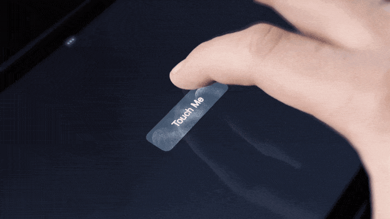

# Button that remembers

If you take a moment to observe the real-world interaction systems around us that have been used for some time, you'll notice they tell a story of past interactions. You can see the physical evidence of how users have interacted with them – like scratches and fingerprints. While some might view this wear and tear as a drawback, I believe it has several components that help make the UX better.

1. **Memory: Collective and Personal**. These artifacts store the history of interactions. This storage system has a practical impact: it optimizes our cognitive load. When interacting with a system, it subtly guides you based on your past interactions. For instance, the most worn button on a dashboard often indicates the starting point of interaction.
2. **Insights: Pattern Recognition**. Even with a system you've never used before, these signs of aging can offer valuable clues. They reveal interaction patterns through their imperfections. Take a beat-making machine as an example. The most worn pads – maybe those labeled "Kick," "Hits," and "Share" – not only show their frequent use but also guide you on how to interact with the device and which aspects of it deserve your attention.

I made a prototype to understand how the idea might work on touch devices. I slightly exaggerated the "aging" effect. But it felt good. This approach would benefit spatial interaction systems more since it resembled real-world objects' behavior the most.

[Learn More](https://twitter.com/Volorf/status/1737018405201273254)

## Contact me
[Twitter](https://www.twitter.com/volorf) | [Linkedin](https://www.linkedin.com/in/oleg-frolov-6a6a4752/) | [Dribbble](https://dribbble.com/Volorf) | [Personal Site](https://olegfrolov.design/)